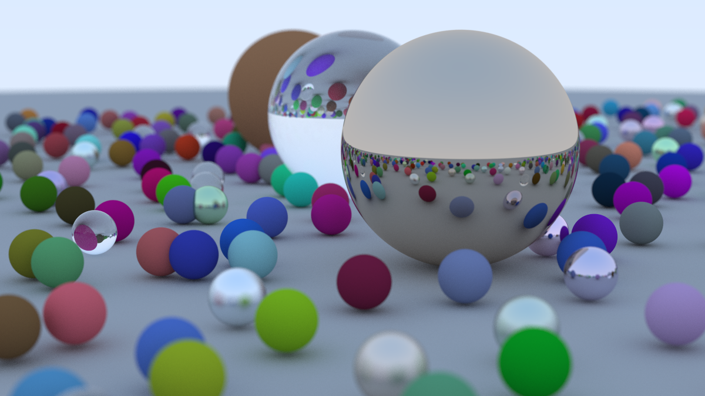

# Tarea 1: Ray Tracer

El objetivo de esta tarea es poner en práctica los conocimientos básicos de **C++** y su sintaxis. Para ello, completarán la implementación de un *Ray Tracer* (técnicamente, un *Path Tracer*).

Se provee el código base con las clases y métodos necesarios. Únicamente deberán completar los siguientes elementos:

* **[src/color.h](./src/color.h)**:
  * Función `linear_to_gamma`.
* **[src/interval.h](./src/interval.h)**:
  * Constructor con parámetros.
  * Métodos `size`, `contains` y `clamp`.
* **[src/ray.h](./src/ray.h)**:
  * Todos los constructores y métodos de la clase `ray`.
* **[src/vec3.h](./src/vec3.h)**:
  * Métodos de acceso `x()`, `y()`, `z()`.
  * Funciones y operadores: `length()`, `dot()` y la sobrecarga de operador (`*=`).


---

## Compilación y Ejecución

1. **Compilar el proyecto:**
   ```bash
   cmake -B build
   cmake --build build
   ```

2. **Ejecutar el programa:**
   *(La ejecución puede tomar un par de minutos dependiendo de tu equipo)*
   
   * En Linux / macOS:
     ```bash
     ./build/RayTracer > image.ppm
     ```
   * En Windows (PowerShell / Command Prompt):
     ```bash
     ./build/Debug/RayTracer.exe > image.ppm
     # o ./build/RayTracer.exe > image.ppm según el generador de CMake usado
     ```

> **Nota:** Para visualizar el archivo `.ppm` resultante pueden usar herramientas como **GIMP**, **IrfanView** o la extensión **PPM/PGM Viewer** en VS Code.

### Resultado esperado
La imagen obtenida debe ser muy similar a la siguiente (puede variar la resolución):



---

## Referencias
Parte del código base y conceptos provienen de [_Ray Tracing in One Weekend_](https://raytracing.github.io/books/RayTracingInOneWeekend.html), el cual es un excelente libro para quien guste adentrarse en el mundo del RayTracing.

---

## Entrega
* **Fecha límite:** [10/09/2026 a las 23:59 hrs]
* Enviar el enlace a su repositorio de GitHub con su solución.
* Por cada semana de retraso se descontará 1 punto sobre la calificación final.

---

## Dudas
Para cualquier duda o aclaración, contactar al correo: **ramarc2@ciencias.unam.mx**
